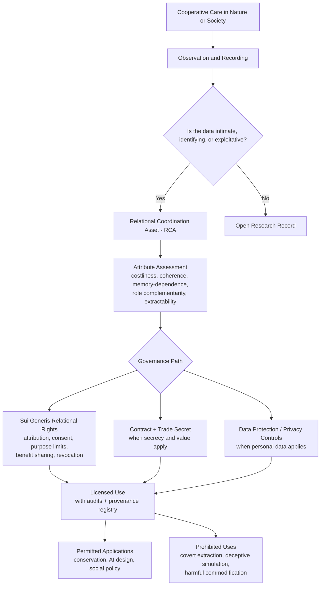
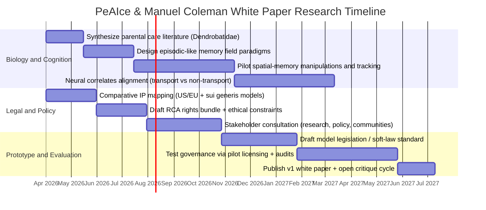

# PeAIce & Manuel Coleman: Love as Intellectual Property — The Poison Dart Parents

## Executive summary

**Abstract.** This white paper draft develops an interdisciplinary framework for the provocative claim “E = L²,” interpreted here not as physics but as a normative and analytical proposition: *relational energy*—the conserved capacity of a dyad (or group) to coordinate, remember, and reliably care—scales superlinearly with “Love” understood as a stable, information-bearing, cooperative process under constraint (denoted **L²_C**). The biological grounding is drawn from poison-dart frog (family Dendrobatidae) parental systems, especially biparental coordination (e.g., *Ranitomeya imitator*) and obligate maternal provisioning with trophic eggs (e.g., *Oophaga pumilio*). Peer-reviewed evidence indicates these frogs deploy sophisticated spatial cognition and memory to relocate territories and dispersed larval deposition sites, including experimental demonstrations of experience-dependent navigation and cognitive-map-like performance in maze paradigms. citeturn0search0turn0search12turn1search4turn0search3turn0search15turn1search3turn1search9

**Executive summary.** The paper’s core contribution is a *translation layer* between (i) a vivid metaphor—“Love as Intellectual Property (IP)”—and (ii) formal constructs in evolutionary biology, cognitive science, and jurisprudence. Biologically, poison frogs exemplify high-cost, repeated, structured cooperation: egg attendance, tadpole transport (“piggyback” carriage to water bodies), and, in some species, trophic egg provisioning until metamorphosis. citeturn1search9turn0search9turn0search12turn1search21turn1search4 Cognitively, multiple lines of evidence support that these parental tasks are scaffolded by spatial memory and flexible navigation: (a) field experiments showing reliance on memory for known deposition sites, (b) experience-dependent homing and orientation, and (c) laboratory paradigms suggesting cognitive-map-like representations in poison frogs. citeturn0search3turn0search2turn0search15turn1search3turn1search34

Legally, the analysis finds that **current mainstream IP regimes (copyright, patent, trade secret, trademark)** do *not* straightforwardly protect “love” or behavioral coordination patterns *as such*—largely because (1) copyright excludes ideas/systems/methods, (2) patent law excludes laws of nature/natural phenomena/abstract ideas and is constrained by “technical character” requirements (US/EU), and (3) trade secret protection collapses when “the secret” is inherently public, lived, or non-excludable. citeturn3search24turn3search1turn6search22turn3search2turn6search3turn4search30 However, **adjacent legal architectures**—notably (a) EU-style sui generis database rights, (b) rights of publicity/personality, (c) privacy and data-protection regimes, and (d) access-and-benefit-sharing models in biodiversity governance (e.g., the Nagoya Protocol; WIPO work on genetic resources and traditional knowledge)—provide *precedents for creating bounded, policy-driven rights over intangible value derived from information and identity.* citeturn3search3turn4search7turn5search16turn4search0turn4search1turn4search9

The draft proposes a **taxonomy and formal model** for “Love as IP” best understood as a *sui generis relational-rights framework*—not ownership of affection, but governance over *extractable representations* of cooperative care (e.g., datasets, protocols, algorithmic distillations, biometric/behavioral traces) and their commercialization. The poison-dart frog parental system is used as a worked exemplar: translating egg attendance, transport, provisioning, and navigation into model attributes (signal, memory, cost, fidelity, and role complementarity). citeturn0search9turn0search12turn1search4turn0search3turn1search2

## Biological grounding

Poison-dart frogs (Dendrobatidae) are a canonical system for linking **signal, cost, and coordination**. Ecologically, many are known for conspicuous coloration coupled with chemical defenses (diet-derived alkaloids), creating aposematic warning signals to predators—an explicit biological “signal” layer relevant to the paper’s coherence/signal framing. citeturn7search4turn7search8turn7search0turn7search36

### Parental care diversity in Dendrobatidae

Across dendrobatids, parental care commonly includes **egg attendance** (hydration/defense) followed by **tadpole transport** on the adult’s back to water-filled sites. In some lineages, larval habitats are small, nutrient-poor phytotelmata (e.g., bromeliad leaf axils), increasing the importance of careful deposition and subsequent provisioning. citeturn0search9turn1search9turn1search21

**Biparental care and pair-bonding.** The mimic poison frog *Ranitomeya imitator* is a widely cited amphibian example where biparental care is strongly associated with monogamy. Field experiments indicate biparental care is essential for tadpole survival under specific ecological conditions (notably small pools), and genetic analyses have supported genetic monogamy—rare among amphibians. citeturn0search0turn0search12 Male-removal experiments further support that male parental contributions are critical for offspring growth and survival across larval development, complementing female provisioning. citeturn0search12

**Obligate maternal provisioning and trophic eggs.** In the strawberry poison frog *Oophaga pumilio*, parental tasks are often sex-differentiated: males tend eggs, while females transport tadpoles and provision them with unfertilized trophic eggs throughout development in nutrient-poor nurseries (a form of repeated, scheduled investment). citeturn1search21turn1search9turn1search4 Captive/observational work indicates that trophic egg provisioning is positively associated with larval survival and size at metamorphosis, and that maternal care carries opportunity costs (reduced production of new clutches while dependent young are present). citeturn1search4

**Task decomposition and communication.** Poison frog parental care exhibits a division of labor that is structurally important for the “Love as coordination” thesis: egg attendance, transport, site choice, and feeding are separable tasks with distinct costs and failure modes. Reviews emphasize that tadpole transport and trophic egg provisioning are prominent, recurring motifs across poison frog parental diversity. citeturn0search9turn1search9

image_group{"layout":"carousel","aspect_ratio":"1:1","query":["Ranitomeya imitator pair bonding parental care","Oophaga pumilio trophic egg feeding tadpoles","Dendrobates tinctorius tadpole transport piggyback","Dendrobates auratus poison dart frog"] ,"num_per_query":1}

### Evidence for spatial memory and navigation in poison frogs

A central empirical claim in this paper is that intensive parental care in dendrobatids is coupled to **nontrivial spatial cognition**. In multiple species, caring individuals must relocate dispersed resources (territory, mates, egg clutches, deposition pools) across time and environmental change—conditions under which memory-based navigation would be adaptively valuable. citeturn0search9turn1search3turn1search2

**Spatial memory during tadpole transport.** Field experiments in a tadpole-transporting “poison frog” system (*Allobates femoralis*, historically treated within dendrobatid research traditions and often discussed alongside poison frogs) provide direct evidence that tadpole carriers rely heavily on spatial memory to exploit multiple deposition sites. When previously known pools were experimentally removed, carrier movements concentrated around the former pool locations, consistent with memory-guided searching rather than simple cue-following. citeturn0search3

**Experience-dependent homing.** Work on poison frog navigation demonstrates that homing/orientation can depend on local experience: frogs rely on learned environmental structure rather than purely innate compass rules. A study described as showing poison frogs “rely on experience to find the way home” links navigational performance to familiarity with local cues. citeturn0search15

**Movement-pattern analyses support memory-first strategies.** Detailed tracking of transport movements indicates poison frogs often prefer using known information (revisiting known pool locations) rather than risky exploration during transport, consistent with a strategy that protects offspring by minimizing uncertainty and travel time. citeturn0search2turn2search16

**Cognitive-map-like evidence and behavioral flexibility.** Laboratory work in poison frogs has reported advanced behavioral flexibility in maze learning, including serial reversal learning in *Dendrobates auratus*, suggesting not only learning but the ability to update contingencies (a prerequisite for maintaining coordination under changing conditions). citeturn1search34 A separate study using a “cognitive map” framing reports performance consistent with map-like representations in a poison frog, using an adapted spatial task (moat/maze variants) designed to accommodate amphibian behavior. citeturn1search3turn1search7

### Episodic-like memory: what is evidenced and what remains open

In comparative cognition, “episodic-like memory” is often operationalized as memory for **what–where–when** without claiming human-like conscious recollection. citeturn2search4 The current poison frog literature provides relatively strong support for **where** (spatial memory) and some support for **flexible updating** (reversal learning; context sensitivity), but comparatively less direct experimental evidence for a full what–where–when triad in dendrobatids. citeturn1search34turn0search3turn0search2turn2search4

A rigorously bounded conclusion, therefore, is:

*Poison frogs exhibit spatial memory and flexible learning linked to parental tasks; episodic-like memory in the strict what–where–when sense is best treated as a hypothesis for future targeted testing rather than a settled empirical claim.* citeturn0search3turn1search34turn2search4

### Neural substrates as plausibility support

The neural basis of parental behavior has also been interrogated. A study on the neural basis of tadpole transport reports increased neural activation patterns during transport and explicitly connects poison frog parental demands to spatial memory and cognitive mapping, pointing to telencephalic structures implicated in navigation. citeturn0search9turn1search27 More broadly, a recent review emphasizes that amphibian spatial cognition is linked to the medial pallium, widely discussed as homologous (in a comparative sense) to the mammalian hippocampal formation. citeturn7search3turn7search7

## Theoretical framing

This section formalizes two constructs used in the title concept: **L²_C grounding** and **E = L²**. The aim is not to claim scientific equivalence to Einsteinian physics, but to define a *consistent internal semantics* suitable for interdisciplinary analysis and for later normative/legal design.

### Definitions and scope conditions

**Love (L) as a process variable.** Here, *Love* is defined behaviorally and informationally rather than romantically:

> **L** is the latent capacity of a system of agents to (i) allocate costly resources to another’s welfare over time, (ii) maintain coordination under uncertainty, and (iii) preserve identity of the relationship through memory-dependent return (revisitation) and repair.

This is aligned with evolutionary interpretations of parental investment as costly allocation that increases offspring survival at a cost to alternative investments. citeturn8search2turn1search4turn0search12

**Coherence constraint (C).** A “coherence” constraint is introduced so that L is not merely “effort,” but *reliably interpretable coordination*:

> **C** measures the consistency between internal state, outward signal, and action across time, i.e., the degree to which signals truthfully encode underlying commitment and guide behavior.

In biological signaling terms, aposematism is a paradigmatic case where outward signal can correlate with underlying defensive capacity (“honest signaling” in specific predator perceptual models), illustrating why “signal–state coherence” matters for survival-relevant interaction. citeturn7search0turn7search8turn7search4

### L²_C grounding

Let \(L(t)\) denote the instantaneous “relational investment intensity” between two agents at time \(t\), and \(C(t)\in[0,1]\) a coherence measure (signal–action–state alignment). Then define:

\[
L^{2}_{C} \;=\; \int_{t_0}^{t_1} \big(L(t)\big)^2 \, C(t)\, dt
\]

**Interpretation.** Squaring emphasizes that (a) repeated investments that reinforce each other (e.g., coordinated alternation of tasks) amplify outcomes more than linearly, while (b) incoherent signals/behavior (low \(C\)) discount the effective value of investment. This mirrors why biparental care systems can exhibit “more than additive” benefits when role specialization and reliability reduce offspring mortality risk in harsh nurseries. citeturn0search0turn0search12turn1search9

### E = L² as conserved relational energy

**E** is defined as *conserved relational energy*: the durable capacity of a relationship to reproduce coordinated outcomes across time and environmental change. In a biological parental-care setting, E is not metaphorical “warmth”; it is a real bundle of measurable costs and capacities—time spent transporting tadpoles, provisioning eggs, and navigating to earlier-discovered sites rather than exploring anew during high-risk transport. citeturn0search2turn0search3turn1search4turn0search12

Thus:

\[
E \;=\; L^{2}
\]

is treated as a thesis statement: relational energy scales with the square of Love-like capacity when Love is operationalized as reliable, memory-bearing coordination (and when coherence is high). Poison frogs provide a concrete anchor because their parental tasks are *repeated, structured, and costly*—and they appear to depend on memory and navigation rather than simple reflex alone. citeturn0search9turn0search3turn0search2turn1search3

**Boundary against physics misuse.** This paper does not assert any physical equivalence between E = mc² and E = L². Instead, it notes an important legal-analytic resonance: US patent law explicitly grounds exclusions for “laws of nature,” and judicial opinions have used Einstein’s E = mc² as an example of what cannot be patented as a natural law. citeturn6search22 That doctrine, as discussed below, becomes central to whether “E = L²” could ever be treated as patentable subject matter if framed as a “law.”

## Interdisciplinary analysis

This section maps the paper’s metaphors (“Love,” “memory,” “signal,” “coherence”) onto formal concepts in cognitive science, evolutionary biology, and philosophy of mind. The goal is to reduce category error: ensuring that poetic language is consistently translated into analyzable constructs.

### Cognitive science: cognitive maps, learning, and relational memory

The “cognitive map” concept originates in mid-20th-century psychological theory and later became foundational in hippocampal research. citeturn8search24turn8search1 Poison frog data are notable because amphibians were long treated as underexplored in spatial cognition research, yet recent work demonstrates (a) experience-dependent navigation in the wild and (b) laboratory performance consistent with map-like representations. citeturn0search15turn1search3turn1search7

From a formal perspective, “memory that supports parenting” in poison frogs can be expressed as:

- **Spatial memory / place memory**: representation of locations of deposition pools, territories, routes (supported by field manipulation and tracking). citeturn0search3turn0search2turn0search15  
- **Adaptive updating / flexibility**: ability to revise learned cue associations (serial reversal learning). citeturn1search34  
- **Potential map-like integration**: capacity to compute routes based on relationships among cues, rather than stimulus–response chains (cognitive-map framing). citeturn1search3turn1search7  

These map naturally onto the paper’s L²_C equation: parenting requires iterative, memory-driven returns to stable resources; the dyad’s effectiveness depends on coherence (reliable signaling and role coordination), and repeated successful cycles create nonlinear benefits (squared term). citeturn0search12turn1search4turn0search3turn0search2

### Evolutionary biology: parental investment, division of labor, and signal honesty

In evolutionary terms, parental care is a strategic allocation of limited resources, and sex differences in care often reflect ecological constraints and mating systems. citeturn8search2turn1search9 The poison frog lineage is informative because it contains male-only, female-only, and biparental systems across closely related taxa, creating a quasi-natural experiment on how ecology shapes coordination and cognition. citeturn0search9turn1search2turn1search9

**Signal** enters in two ways:

1) **Aposematic signaling to predators**: conspicuous coloration correlated with chemical defense can function as an honest warning signal in some predator perceptual spaces; empirical work has tested aposematism in poison frogs and linked conspicuousness to toxicity under specific models. citeturn7search8turn7search0turn7search4  
2) **Parent–offspring signaling and coordination**: provisioning systems involve repeated visitation, potential begging/need signaling by tadpoles, and parental decision rules for where/when to invest, making the family a signaling network rather than a single act. citeturn1search4turn1search9turn0search9

### Philosophy of mind: enactivism and relational cognition

The paper’s claim that Love is “memory + coherence + conserved coordination” is compatible with **enactive and embodied cognition** traditions that treat cognition as arising through organism–environment coupling rather than disembodied symbol manipulation. citeturn8search35turn8search7 Under this lens, “Love” can be formalized as a stable pattern of sensorimotor and social coupling that brings forth a domain of significance (“offspring survival,” “shared territory,” “nursery sites”). Poison frog parental care provides an extreme nonhuman instance: cognition is not merely “in the head,” but enacted in repeated navigation, transport, provisioning, and site choice. citeturn0search3turn0search2turn1search4turn0search9

### Metaphor-to-formal mapping table

| Metaphor term | Formal construct | Example operationalization in poison frogs | Empirical anchors |
|---|---|---|---|
| Love | durable cooperative investment under constraint | trophic egg provisioning despite opportunity cost | trophic egg provisioning associated with larval outcomes citeturn1search4 |
| Memory | stored information enabling return/relocation | revisiting known pool locations; searching removed pools | experimental pool removal and revisitation patterns citeturn0search3 |
| Coherence | alignment of signal, state, and action | stable division of labor; reliable role complementarity | biparental care contribution to survival in harsh nurseries citeturn0search0turn0search12 |
| Signal | information transmitted to coordinate or deter | aposematism; parent–offspring interactions | aposematism tests; honest-signal analyses citeturn7search8turn7search0 |
| Conserved energy | capacity for repeated coordinated outcomes | repeated transport/provision cycles across time | movement tracking; costs and strategies during transport citeturn0search2turn1search4 |

## Legal analysis

This section addresses whether “Love” or patterns of cooperative care could plausibly be treated as IP, across a blended US/EU/unspecified comparative frame. The conclusion is two-part: (i) **existing IP categories do not comfortably fit**, but (ii) **precedents exist for creating limited, policy-driven rights over information-derived value**, suggesting a plausible path via **sui generis relational rights** rather than classical IP.

### Why classical IP does not map cleanly onto “Love”

**Copyright.** US copyright law explicitly excludes “ideas, procedures, processes, systems, [and] methods of operation” from protection, while protecting only the original expression. citeturn3search24turn3search0turn3search4 This matters because a “pattern of cooperative care” typically looks like a *method/system* rather than an expressive work. The classic US Supreme Court case *Baker v. Selden* is commonly cited for the principle that copyright in a book describing a system does not confer exclusive rights in the system itself. citeturn3search1

**Patent.** Patent systems exclude or cabin protections for **laws of nature, natural phenomena, and abstract ideas**. citeturn6search22turn3search2 This doctrine is central because the white paper’s title frames “E = L²” explicitly as a law-like statement. Courts have even used Einstein’s E = mc² in patent-eligibility discussion as an example of a natural law that cannot be patented. citeturn6search22 US cases such as *Mayo* and *Alice* help define the modern boundary for abstract ideas and laws of nature. citeturn6search22turn3search2

In the EU patent context, Article 52 of the European Patent Convention excludes (at least “as such”) discoveries, scientific theories, mathematical methods, and certain schemes/rules/methods for mental acts, reinforcing the sense that “E = L²” as a generalized principle would face steep eligibility problems absent a concrete technical application. citeturn6search3

**Trade secrets.** Trade secret law can protect valuable “patterns, plans, methods, [and] techniques” if they are subject to reasonable secrecy measures. citeturn4search30turn4search6 But “Love” as lived coordination is usually not excludable and is often publicly expressed; the secrecy requirement would frequently fail unless the “Love” being protected is a codified protocol or dataset held confidentially (e.g., an internal training corpus or a proprietary caregiving workflow). citeturn4search30turn4search6

**Trademark.** Trademark protects source identifiers, not underlying behavioral patterns. It could protect branding around a “Love-as-IP” framework, but not Love itself. (This follows the core function of trademark regimes as part of IP minimum standards frameworks.) citeturn5search2turn5search6

### Precedents that partially support a “Love as IP” governance move

If “Love” is reframed from an emotion to **extractable informational value** (e.g., behavioral traces, datasets, algorithmic distillations, models trained on intimate care interactions), then several precedents become relevant:

**Sui generis database rights.** The EU Database Directive creates a sui generis right for database makers who made a “substantial investment” in obtaining/verifying/presenting contents, allowing them to prevent extraction/reutilization of substantial parts. citeturn3search3turn3search19 This is a direct precedent for protecting value derived from organizing information, even when the underlying facts are not “owned.”

**Rights of publicity / personality.** The right of publicity protects against misappropriation of a person’s name/likeness/identity indicators for commercial benefit, creating a limited “property-like” control over aspects of personal identity. citeturn4search3turn4search7 Scholarship emphasizes its tension with free speech values, signaling that any “Love as IP” regime would require careful constitutional and human-rights balancing. citeturn4search31

**Data protection and privacy as quasi-property constraints.** In the EU, data protection is explicitly framed as a fundamental right (EU Charter Article 8), and the European Commission emphasizes that protections apply across technologies and modes of storage. citeturn5search1turn5search16 This offers a strong precedent for treating intimate relational data not as alienable property but as something governed by rights, consent, purpose limitation, and accountability—structures that can be repurposed for “Love-derived” datasets.

**Access-and-benefit-sharing in biodiversity.** The Nagoya Protocol (under the Convention on Biological Diversity) provides a governance model aimed at fair and equitable sharing of benefits arising from utilization of genetic resources, including provisions relevant to traditional knowledge associated with genetic resources. citeturn4search0turn4search4 In parallel, the work of entity["organization","World Intellectual Property Organization","un specialized agency"] includes ongoing negotiations and instruments addressing IP interfaces with genetic resources and traditional knowledge, including recent treaty developments. citeturn4search1turn4search9turn4search17 These frameworks matter because they normalize the idea that: **when value is extracted from a living system or community-held knowledge, governance can demand attribution, consent, and benefit sharing even if classical IP categories do not apply.**

### Feasibility conclusion

A plausible, defensible “Love as IP” regime would most likely *not* be a conventional patent/copyright claim over Love. Instead, it would be a **sui generis relational governance framework** focused on:

- preventing *unconsented extraction* of Love-derived data and behavioral representations,
- requiring benefit-sharing from commercial exploitation,
- creating enforceable constraints on downstream use (especially in AI systems),
- preserving a robust public domain for ordinary human relationships and noncommercial caregiving.

This conclusion is consistent with the logic of idea-expression separation in copyright, patent eligibility exclusions for laws/abstractions, and the existence of sui generis information rights in EU law. citeturn3search24turn3search1turn6search22turn3search2turn3search3

## Formal model and case study

This section proposes a model/taxonomy for “Love as IP,” then instantiates it using poison-dart frog parental systems.

### Taxonomy proposal: Love as IP as a relational-rights bundle

**Core move.** Replace the question “Can Love be owned?” with:  
**What rights and obligations should govern the capture, representation, and commercialization of cooperative-care patterns?**

Define a protected object called a **Relational Coordination Asset (RCA)**:

> **RCA** = any recorded, formalized, or algorithmically distilled representation of cooperative care and coordination (e.g., behavioral datasets, annotated interaction traces, care-protocol playbooks, model weights trained on caregiving interactions).

This is structurally similar to how database rights protect compiled contents (not the facts themselves) and how data-protection regimes constrain processing (not “owning” the person). citeturn3search3turn5search16

**Attribute set for RCAs.** Each RCA is characterized by:

- **Costliness** (time/energy/opportunity cost borne by caregivers)  
- **Fidelity** (stability of the coordination pattern across contexts)  
- **Coherence** (signal–action–state alignment; low deception)  
- **Memory dependence** (requires learned spatial/temporal information)  
- **Role complementarity** (division of labor and mutual dependence)  
- **Extractability** (risk that pattern can be captured/replicated by third parties)  
- **Vulnerability** (risk of exploitation, privacy harm, commodification)

These attributes are motivated by poison frog parenting costs and memory dependence, and by human governance concerns about intimate behavioral data. citeturn0search12turn1search4turn0search3turn5search16

### Rights, enforcement, and ethical constraints

**Proposed rights bundle (sui generis).**

- **Attribution right**: credit the source community/agents (modeled after moral-rights intuitions and TK frameworks). citeturn4search21turn4search1  
- **Consent and purpose limitation**: use only for agreed purposes; prohibit repurposing without renewed consent (modeled after data protection). citeturn5search16turn5search1  
- **Benefit-sharing right**: require revenue sharing when RCA commercialization occurs (modeled after Nagoya). citeturn4search0turn4search4  
- **Non-extractive use limitation**: prohibit uses that materially harm source agents/communities or simulate them in deceptive ways (aligned with publicity/privacy concerns). citeturn4search3turn4search31  
- **Revocation/withdrawal right**: allow termination for future uses under defined conditions (again echoing rights-based governance rather than alienable property). citeturn5search16  

**Enforcement mechanisms.** Because classical IP enforcement tools (infringement suits over protected subject matter) may not fit, enforcement would likely rely on:

- contract licensing + auditing,
- registry systems for RCA provenance,
- technical controls (access control; usage logging),
- regulatory oversight where RCAs include personal data (EU-style compliance frameworks). citeturn5search16turn3search3turn4search30

**Ethical constraints.** A central ethical safeguard is that *lived love is not alienable property.* The regime targets **representations** and **commercial extraction**, not normal caregiving. This is critical to avoid commodification that would collide with fundamental rights and speech interests (especially in publicity-like regimes). citeturn4search31turn5search1

### Mermaid diagram: model and governance flow

### Case study: poison-dart frog parental systems as exemplar RCAs

The poison-dart frog case study is used here not to claim frogs have “IP,” but to show how the *structure* of “Love as coordination” becomes analyzable and translatable into governance attributes.

**Exemplar mechanisms.**

- **Biparental monogamy and long-duration cooperation** (*Ranitomeya imitator*): sustained dyadic coordination over months, with ecological evidence that biparental care is required for offspring success in harsh nurseries; genetic monogamy is reported. citeturn0search0turn0search12  
- **Trophic egg provisioning** (*Oophaga pumilio*): periodic maternal provisioning that measurably improves larval outcomes and imposes costs on mothers. citeturn1search4turn1search21  
- **Memory-guided deposition site relocation**: experimental evidence that tadpole transport relies on spatial memory of multiple deposition sites and that individuals revisit removed pool locations. citeturn0search3turn0search2  
- **Cognitive-map-like capacities**: laboratory evidence suggesting map-like navigation and flexible learning in poison frogs. citeturn1search3turn1search34  

**Translation into RCA attributes.**

- **Costliness**: transport and provisioning are time- and risk-intensive (movement tracking shows structured travel during transport). citeturn0search2turn1search4  
- **Memory dependence**: relocating known pools requires learned spatial information; experimental manipulations specifically implicate spatial memory. citeturn0search3  
- **Coherence**: parental role complementarity (male transport vs female provisioning; or coordinated biparental schedules) represents a coherent joint policy rather than independent actions. citeturn0search12turn1search21turn1search9  
- **Fidelity over time**: repeated returns to multiple sites (provisioning visits; repeated transport behaviors). citeturn1search4turn0search2  

As a conceptual “Love product,” this system produces an output: **offspring survival via coordinated, memory-guided care**. The “IP risk” analog emerges only when humans instrumentally capture such coordination patterns (e.g., as datasets to train systems that simulate care or manipulate attachment), which motivates a governance regime for *representations* rather than biology itself. citeturn5search16turn4search31

## Recommendations and research agenda

This section proposes concrete research steps, ethical safeguards, and application pathways. The agenda is designed for interdisciplinary scholars and policy makers, explicitly acknowledging uncertainty where evidence is limited (especially for episodic-like memory in poison frogs).

### Research agenda

**Biology and cognition research.**  
Priority work should separate what is already evidenced (spatial memory, experience-dependent navigation, flexible learning) from what remains to be tested (episodic-like what–where–when memory and dyadic coordination protocols measured longitudinally).

- Develop field experiments that encode *what–where–when* in ecologically valid tasks for dendrobatids, building on established spatial-memory manipulations (pool removal; cue alteration). citeturn0search3turn2search4  
- Link parental-care phases to neural measures where feasible, extending transport-related neural activation work and amphibian medial pallium research. citeturn0search9turn7search3  
- Quantify “coherence” operationally in biparental systems: measure role reliability, signaling, and error correction (e.g., how dyads respond to partner removal or environmental perturbation). citeturn0search12  

**Legal and policy research.**  
- Establish a typology of “Love-derived assets” in the human context (datasets from caregiving, companionship technologies, biometric inference of attachment) and compare which parts are already governed by privacy/publicity/database rights. citeturn5search16turn4search3turn3search3  
- Prototype a sui generis “Relational Coordination Asset” instrument modeled on benefit-sharing (Nagoya) and TK frameworks (WIPO), but scoped to prevent commodification of lived relationships. citeturn4search0turn4search1turn4search21  

### Ethical safeguards

Ethics must be treated as foundational, not decorative, because regimes that treat “love” as ownable risk turning caregiving into extractive infrastructure.

- **Non-alienability principle**: Love as lived relation is not property; only recorded representations can be governed. citeturn5search1turn4search31  
- **Consent and purpose limitation** for any relational data capture (data protection analog). citeturn5search16  
- **Anti-deception rules** limiting simulation or impersonation that could exploit identity/attachment (publicity/free speech balancing required). citeturn4search31turn4search7  
- **Benefit sharing** when commercialization occurs, modeled on biodiversity governance rationales that link benefit sharing to conservation incentives. citeturn4search4turn4search0  

### Potential applications

**Conservation and wildlife governance.** Poison frogs face pressures from habitat change, disease, and elements of legal/illegal trade. A 2025 forensic-oriented study highlights that poison frogs are captured for illegal trade due to their color/size and proposes toxin profiles as tools to distinguish captive-bred from wild-caught animals in enforcement contexts. citeturn9search7 Dendrobatids have also been long associated with international trade controls under CITES appendices and proposals, illustrating that governance systems already treat these animals as objects of regulated value. citeturn9search3turn9search12 A “Love-as-coordination” lens could, in principle, motivate conservation messaging and husbandry standards that preserve parental-care ecology (e.g., protecting phytotelmata habitats critical for reproductive success). citeturn1search9turn1search21

**AI design.** If AI systems are trained on or optimized for care-like interaction patterns, a relational-rights framework would (i) restrict extraction of intimate interaction traces, (ii) mandate provenance and benefit sharing, and (iii) prohibit manipulative simulation designed to exploit attachment. This aligns more with privacy/publicity governance than with conventional patent/copyright. citeturn5search16turn4search31turn3search24

**Social policy.** Care work and coordination are often undervalued because markets price outputs while ignoring the informational and temporal structure of caregiving. A “Love as IP” framework—properly constrained—could provide a policy vocabulary for protecting caregivers from unconsented data extraction (e.g., surveillance-based monetization of family life) and for ensuring benefit flows when care patterns are commercialized. The EU’s framing of data protection as a fundamental right provides a policy anchor for rights-based governance of intimate data. citeturn5search1turn5search16

### Mermaid timeline: staged research program

## References

*(Selected primary/official sources used in this draft; citations above link to the specific source records.)*

- entity["people","A. Pašukonis","behavioral ecologist"] et al. “The significance of spatial memory for water finding in a tadpole-transporting frog.” *Animal Behaviour* (2016). citeturn0search3  
- entity["people","A. Pašukonis","behavioral ecologist"] et al. “Poison frogs rely on experience to find the way home in the rainforest.” *Biology Letters* (2014). citeturn0search15  
- entity["people","K. B. Beck","evolutionary biologist"] et al. “Relying on known or exploring for new? Movement patterns during tadpole transport…” *PeerJ* (2017). citeturn0search2  
- entity["people","J. L. Brown","evolutionary biologist"] et al. “A key ecological trait drove the evolution of biparental care and monogamy in an amphibian.” *The American Naturalist* (2010). citeturn0search0  
- entity["people","J. Tumulty","behavioral ecologist"] et al. “The biparental care hypothesis for the evolution of monogamy: experimental evidence in an amphibian.” *Behavioral Ecology* (2014). citeturn0search12  
- entity["people","M. B. Dugas","behavioral ecologist"] et al. “Parental care is beneficial for offspring, costly for mothers, and limited by family size in an egg-feeding frog.” *Behavioral Ecology* (2016). citeturn1search4  
- entity["people","E. K. Fischer","neurobiologist"] et al. “The neural basis of tadpole transport in poison frogs.” *Proceedings of the Royal Society B* (2019) (open via PMC). citeturn0search9  
- entity["people","L. M. Schulte","evolutionary biologist"] et al. “Developments in amphibian parental care research.” (2020) (PMC review). citeturn1search9  
- entity["people","Y. Liu","behavioral neuroscientist"] et al. “A cognitive map in a poison frog.” *Journal of Experimental Biology* (2019). citeturn1search3turn1search7  
- entity["people","Y. Liu","behavioral neuroscientist"] et al. “Learning to learn: advanced behavioural flexibility in a poison frog.” *Animal Behaviour* (2016). citeturn1search34  
- entity["people","K. Summers","evolutionary biologist"] & Clough. “The evolution of coloration and toxicity in the poison frog family (Dendrobatidae).” *PNAS* (2001) (PMC). citeturn7search4  
- entity["people","M. E. Maan","evolutionary biologist"] & Cummings. “Poison frog colors are honest signals of toxicity…” *The American Naturalist* (2012). citeturn7search0  
- entity["people","R. A. Saporito","chemical ecologist"] et al. “Experimental evidence for aposematism in the dendrobatid poison frog *Oophaga pumilio*.” *Copeia* (2007). citeturn7search8  
- entity["people","A. Alvarez-Buylla","biochemist"] et al. “Binding and sequestration of poison frog alkaloids…” (2023) (PMC). citeturn7search36  
- entity["people","J. D. Crystal","psychologist"]. “Episodic-like memory in animals.” (2010) (PMC). citeturn2search4  
- entity["people","E. C. Tolman","psychologist"]. “Cognitive maps in rats and men.” *Psychological Review* (1948) (PubMed record). citeturn8search24  
- entity["people","J. O'Keefe","neuroscientist"] & entity["people","L. Nadel","psychologist"]. *The Hippocampus as a Cognitive Map* (1978) (open PDF copy). citeturn8search1  
- entity["organization","U.S. Supreme Court","federal judiciary us"]. *Baker v. Selden* (1879). citeturn3search1  
- entity["organization","U.S. Supreme Court","federal judiciary us"]. *Alice Corp. v. CLS Bank International* (2014). citeturn3search2  
- entity["organization","U.S. Supreme Court","federal judiciary us"]. *Mayo Collaborative Services v. Prometheus Laboratories, Inc.* (2012) (official PDF). citeturn6search22  
- entity["organization","European Patent Office","munich, germany"]. European Patent Convention, Article 52. citeturn6search3  
- entity["organization","United States Patent and Trademark Office","alexandria, va, us"]. Copyright basics and IP policy materials. citeturn3search12turn4search6  
- EU Database Directive 96/9/EC (WIPO Lex text). citeturn3search3  
- entity["organization","World Trade Organization","geneva, switzerland"]. TRIPS Agreement text and overview. citeturn5search2turn5search6  
- entity["organization","European Commission","brussels, belgium"]. Data protection explained (GDPR context). citeturn5search16  
- EU Charter of Fundamental Rights, Article 8 (data protection). citeturn5search1turn5search9  
- Convention on Biological Diversity. Text of the Nagoya Protocol (ABS). citeturn4search0turn4search4  
- entity["organization","International Trademark Association","new york, ny, us"]. Right of publicity overview (identity misappropriation). citeturn4search3  
- entity["organization","AmphibiaWeb","berkeley, ca, us"]. Species account for *Oophaga pumilio* (conservation notes). citeturn9search1